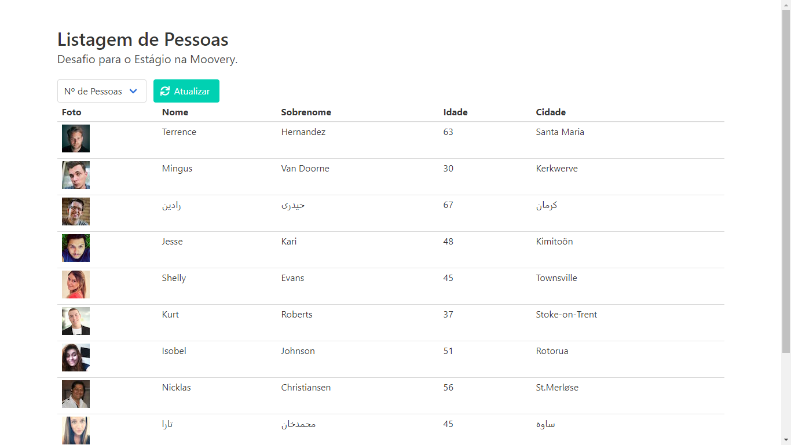

# Listagem de Pessoas

[Sobre](#sobre) | [Ferramentas Utilizadas](#ferramentas-utilizadas) | [Captura da Tela](#captura-da-tela)

## Sobre

Este projeto foi feito para a fase de desafio para a vaga de estágio de desenvolvedor na [Moovery](https://moovery.app/). Onde recuperamos dados de uma API que gera usuários aleatórios e exibimos de forma organizada.

**Acesse https://desafio-estagio-moovery.netlify.app para experimentar a aplicação!**

## Ferramentas Utilizadas

### Produção

- [React JS](https://pt-br.reactjs.org/)
- [Bulma CSS](https://bulma.io/)
- [react-icons](https://react-icons.github.io/)
- [Node.js](https://nodejs.org/pt-br/)

### Desenvolvimento

- [Create React App](https://create-react-app.dev/)
- [Visual Studio Code](https://code.visualstudio.com/)
- [Yarn](https://yarnpkg.com/)

### Implantação

- [Netlify](https://netlify.com/)

## Captura da Tela

